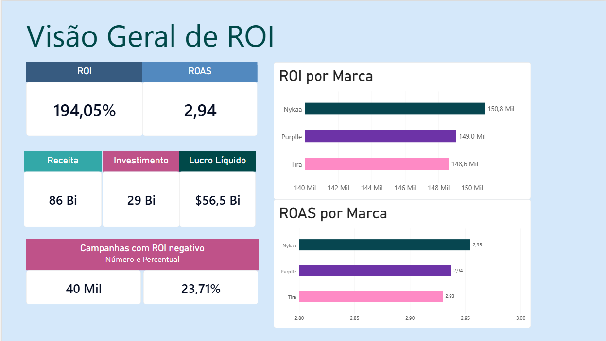
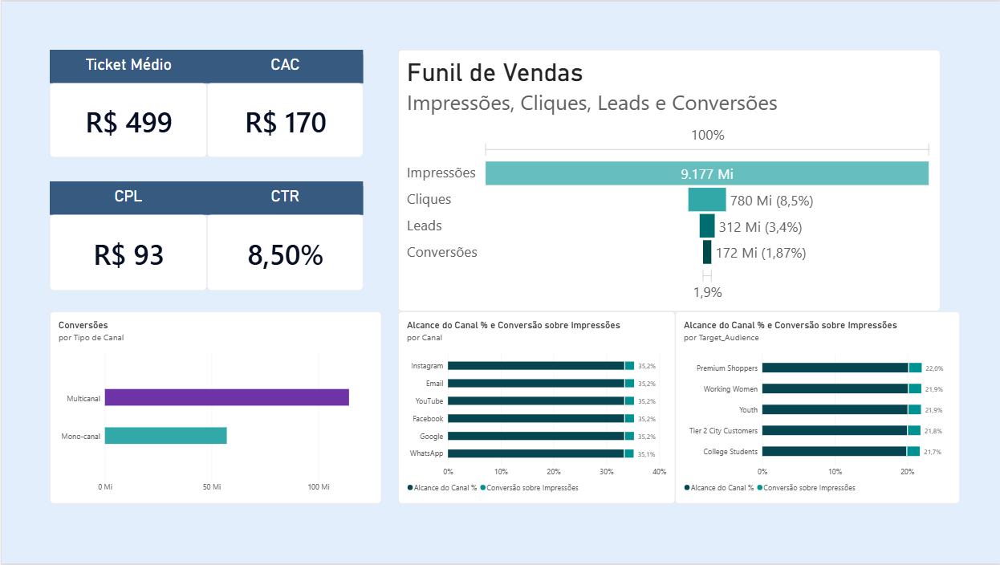
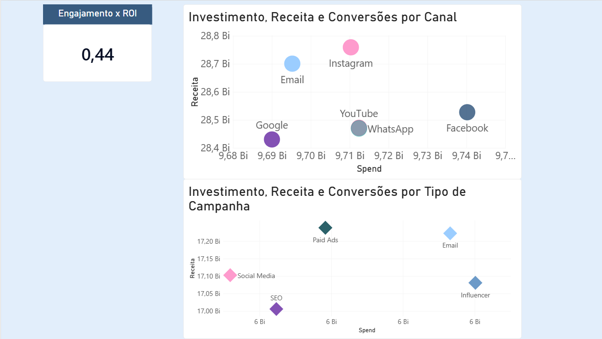

# 📊 Dashboard de ROI de Campanhas de Marketing Digital

**Nykaa · Purplle · Tira** — análise de retorno, funil e eficiência de 166.665 campanhas em Power BI




> 🏆 **Reconhecimento:** projeto desenvolvido em grupo durante um Data Class de Power BI promovido pela **Liga de Data Science** da **Unicamp**. Nosso grupo foi escolhido para **apresentar o dashboard e as análises diretamente ao time da Physa**, que nos deu feedbacks muito positivos.

---

## 🙋 Minha contribuição

Este foi um projeto em grupo: o dashboard e a apresentação foram construídos em equipe. Minha **principal contribuição foi a camada analítica**:

- **Criei as métricas do projeto.** Defini os indicadores, as fórmulas, o que cada um mostra e as regras de agregação (por exemplo, calcular ROI e ROAS de forma agregada, e não como média simples da coluna).
- **Escrevi as fórmulas DAX.** São **28 medidas** e **4 colunas calculadas**, organizadas em pastas por tema, além da tabela auxiliar de canais feita em Power Query.
- **Conduzi a análise geral.** Cruzei ROI, funil, audiência, canal, tipo de campanha e engajamento, e transformei os números em leituras para o negócio.

---

## 🎯 Contexto e objetivo

**Desafio proposto:** Escolher uma base de dados no Kaggle e aplicar tudo o que foi ensinado ao longo das 4 aulas: modelagem relacional, DAX e construção de dashboard.

A base reúne campanhas de marketing de três marcas de beleza (Nykaa, Purplle e Tira) ao longo de 12 meses. O objetivo foi transformar esse volume de dados em respostas objetivas para quem decide onde investir:

- Qual é o **retorno real** das campanhas (ROI, ROAS, lucro líquido)?
- **Onde o funil perde mais gente**, das impressões até a conversão?
- **Qual canal, tipo de campanha e público** entrega mais retorno por unidade investida?
- Campanhas **multicanal** funcionam melhor que as de um canal só?
- O **engajamento** realmente puxa o retorno?
- Que fatia das campanhas **dá prejuízo**?

---

## 🔍 Principais insights

| # | Insight | Números |
|---|---------|---------|
| 1 | **O retorno geral é alto e parecido entre as marcas.** Cada unidade investida devolve 2,94. As três marcas receberam orçamentos praticamente iguais (~9,7 bi cada). | ROI **194,05%** · ROAS **2,94** · Nykaa 195,5% · Purplle 193,7% · Tira 193,0% |
| 2 | **Engajamento é a alavanca mais forte da base.** Quanto maior o Engagement Score, maior o ROI. | Correlação **0,44** · ROI de **−21,7%** (faixa 0–5) a **648%** (faixa 25–30) |
| 3 | **Quase 1 em cada 4 campanhas dá prejuízo.** O ROI agregado é alto porque campanhas muito boas compensam as ruins. | **39.523** campanhas (**23,71%**) com ROI negativo. Na faixa de engajamento mais baixa, 66% delas dão prejuízo; na faixa 25–30, só 1,9% |
| 4 | **Instagram e Email lideram, Facebook fica atrás.** Facebook recebe o maior investimento entre os canais e tem o menor ROI. | Instagram 196,2% · Email 196,0% · Facebook 192,9% |
| 5 | **Paid Ads é o tipo de campanha mais rentável; Influencer, o menos.** Influencer recebe o maior investimento entre os tipos. | Paid Ads 196,3% · Influencer 191,5% |
| 6 | **Multicanal não é, por si só, mais eficiente.** Ele gera o dobro de conversões porque tem o dobro de campanhas. | ROI 194,2% (multicanal) vs 193,8% (mono-canal) · 111.142 vs 55.523 campanhas |
| 7 | **O público planejado quase não coincide com o segmento que converteu**, e isso não muda o ROI. | Só 19,9% das campanhas estão alinhadas (o acaso, com 5 grupos, daria 20%) · ROI 194,3% vs 194,0% |
| 8 | **O maior vazamento pós-clique está na geração de leads.** Só 40% dos cliques viram lead, enquanto 55% dos leads fecham venda. | CTR 8,50% · Taxa de Lead 39,97% · Fechamento 54,99% · 1,87% das impressões viram conversão |

**Leitura para o negócio:** as diferenças entre marcas, canais, tipos de campanha e públicos são pequenas (em geral, menos de 4 pontos percentuais de ROI). Isso indica que **redistribuir orçamento entre essas categorias traz ganhos marginais**. As oportunidades maiores estão em **elevar a qualidade e o engajamento das campanhas** e em **cortar ou corrigir as campanhas de ROI negativo**.

> ⚠️ **Limitações:** a base não tem ID de cliente nem histórico de recompra, então **retenção real não pode ser calculada**. O Engagement Score é usado como *proxy* de qualidade da audiência. A correlação entre engajamento e ROI indica associação, não causalidade.

<details>
<summary><b>Resultados por marca e por canal</b></summary>

| Marca | Campanhas | ROI | ROAS | CAC |
|-------|----------:|----:|-----:|----:|
| Nykaa | 55.555 | 195,45% | 2,95 | 169,03 |
| Purplle | 55.555 | 193,71% | 2,94 | 170,10 |
| Tira | 55.555 | 192,97% | 2,93 | 170,37 |

| Canal | ROI | ROAS | CAC | Alcance do canal |
|-------|----:|-----:|----:|-----------------:|
| Instagram | 196,18% | 2,96 | 168,92 | 33,36% |
| Email | 196,03% | 2,96 | 168,66 | 33,35% |
| Google | 193,40% | 2,93 | 170,80 | 33,35% |
| YouTube | 193,15% | 2,93 | 170,14 | 33,35% |
| WhatsApp | 193,13% | 2,93 | 170,16 | 33,27% |
| Facebook | 192,89% | 2,93 | 170,17 | 33,35% |

*Uma campanha multicanal conta para cada canal que usou, então os canais somam mais de 100% de alcance.*

</details>

---

## 🖼️ Telas do dashboard

O relatório tem **3 páginas**, pensadas como uma sequência: primeiro o retorno, depois o funil, por fim o "onde investir".

### 1. Geral ROI
Visão executiva com ROI, ROAS, receita, investimento, lucro líquido e o percentual de campanhas com ROI negativo, além de ROAS e ROI por marca.


### 2. Funil Performance
Funil de impressões → cliques → leads → conversões, com Ticket Médio, CAC, CPL e CTR. Compara mono-canal e multicanal, e mostra o alcance de cada canal e de cada público junto da conversão sobre impressões.



### 3. Análise por Canal e Tipo
Relação entre investimento, receita e conversões (tamanho da bolha) por canal e por tipo de campanha, mais o indicador de correlação entre engajamento e ROI.



---

## 🗂️ Fonte de dados

Base pública do Kaggle: [Multi-Brand Marketing Campaign Performance Dataset](https://www.kaggle.com/datasets/sshriya08/multi-brand-marketing-campaign-performance-dataset), publicada por **sshriya08** sob a licença [CC BY 4.0](https://creativecommons.org/licenses/by/4.0/). São três arquivos CSV (pasta `baseDeDados/`), um por marca, com a mesma estrutura:

| Arquivo | Marca | Campanhas |
|---------|-------|----------:|
| `nykaa_campaign_data.csv` | Nykaa | 55.555 |
| `purplle_campaign_data.csv` | Purplle | 55.555 |
| `tira_campaign_data.csv` | Tira | 55.555 |

- **Total:** 166.665 campanhas, sem valores nulos e sem `Campaign_ID` duplicado.
- **Período:** jul/2024 a jun/2025.
- **Colunas (16):** `Campaign_ID`, `Campaign_Type`, `Target_Audience`, `Duration`, `Channel_Used`, `Impressions`, `Clicks`, `Leads`, `Conversions`, `Revenue`, `Acquisition_Cost`, `ROI`, `Language`, `Engagement_Score`, `Customer_Segment`, `Date`.
- **Dimensões:** 5 tipos de campanha (Email, Influencer, Paid Ads, SEO, Social Media), 5 públicos (College Students, Premium Shoppers, Tier 2 City Customers, Working Women, Youth) e 6 canais (Email, Facebook, Google, Instagram, WhatsApp, YouTube).
- **Observação importante:** o **investimento (Spend) não existe como coluna**. Ele é calculado como `Acquisition_Cost × Conversions`.
- **Natureza dos dados:** na página do Kaggle, a base é classificada como *sintética*. Por isso, os resultados deste projeto são um exercício analítico e não representam o desempenho real de Nykaa, Purplle ou Tira.
- Os valores monetários seguem a unidade original da base (a moeda não é informada).

---

## 🧱 Modelagem e tratamento

O modelo tem 4 tabelas:

| Tabela | Papel |
|--------|-------|
| `campaign_analytics` | Tabela fato: as 3 bases empilhadas (166.665 linhas), com a coluna `Campaign_Enterprise` identificando a marca |
| `Calendario` | Tabela calculada de datas (jul/2024 a jun/2025), ligada por `Calendario[Date] → campaign_analytics[Date]` |
| `Campanha_Canal` | Tabela criada no Power Query que separa cada canal em uma linha (**333.381 linhas**), ligada por `campaign_analytics[Campaign_ID] → Campanha_Canal[Campaign_ID]` (1:N, filtro nos dois sentidos) |
| `_Medidas` | Tabela só para guardar as medidas DAX |

**Por que separar os canais?** A coluna `Channel_Used` guarda vários canais no mesmo texto (ex.: `"WhatsApp, YouTube"`). Sem separar, não dá para agrupar por canal individual.

<details>
<summary><b>Ver a consulta em Power Query (M) que cria <code>Campanha_Canal</code></b></summary>

```m
let
    Origem = campaign_analytics,
    Colunas = Table.SelectColumns(Origem, {"Campaign_ID", "Channel_Used"}),
    Dividido = Table.TransformColumns(
        Colunas,
        {{"Channel_Used", each Text.Split(_, ","), type list}}
    ),
    Expandido = Table.ExpandListColumn(Dividido, "Channel_Used"),
    Renomeado = Table.RenameColumns(Expandido, {{"Channel_Used", "Canal"}}),
    Aparado = Table.TransformColumns(Renomeado, {{"Canal", Text.Trim, type text}}),
    Tipado = Table.TransformColumnTypes(
        Aparado,
        {{"Campaign_ID", type text}, {"Canal", type text}}
    )
in
    Tipado
```

</details>

---

## 📐 Métricas e DAX

As métricas foram definidas por mim e implementadas em DAX no modelo. Resumo por tema:

| Tema | Métricas |
|------|----------|
| **Retorno financeiro** | Receita, Spend, ROI, ROAS, Lucro Líquido, CAC, Ticket Médio |
| **Funil / eficiência** | CTR, Taxa de Lead, Taxa de Fechamento, Conversão Geral, Conversão sobre Impressões, CPL |
| **Qualidade / engajamento** | Engagement Médio, Correlação Engagement × ROI (Pearson) |
| **Risco** | Campanhas com ROI Negativo, % Campanhas ROI Negativo |
| **Audiência** | Mix Spend %, Participação na Receita %, Índice Retorno vs Investimento, ROI vs Média Geral |
| **Canal** | Alcance do Canal % (e ROI, ROAS, CAC e conversão por canal, reaproveitando as medidas base) |

**Colunas calculadas:** `Qtd Canais`, `Tipo de Canal` (mono-canal ou multicanal), `Faixa Engagement` (faixas de 5 pontos) e `Público Alinhado` (público planejado igual ao segmento que converteu).

### Exemplos

```dax
-- Investimento: não existe na base, então é calculado linha a linha
Spend =
SUMX (
    campaign_analytics,
    campaign_analytics[Acquisition_Cost] * campaign_analytics[Conversions]
)

-- ROI agregado: (ΣReceita − ΣSpend) / ΣSpend
ROI = DIVIDE ( [Receita] - [Spend], [Spend] )

ROAS = DIVIDE ( [Receita], [Spend] )

-- CAC ponderado pelo volume de conversões
CAC = DIVIDE ( [Spend], [Conversões] )

-- Acima de 1: o grupo devolve mais receita do que a fatia do orçamento que consome
Índice Retorno vs Investimento =
DIVIDE ( [Participação na Receita %], [Mix Spend %] )

-- Percentual de campanhas que usam o canal (respeita o filtro da tabela de canais)
Alcance do Canal % =
DIVIDE (
    [Nº Campanhas],
    CALCULATE ( [Nº Campanhas], REMOVEFILTERS ( Campanha_Canal ) )
)

-- Classificação usada na comparação mono-canal vs multicanal
Tipo de Canal =
IF ( campaign_analytics[Qtd Canais] = 1, "Mono-canal", "Multicanal" )
```

### Decisões analíticas que fazem diferença

- **ROI e ROAS são sempre agregados** (soma de receita ÷ soma de investimento), e não a média da coluna `ROI`. A média simples dá o mesmo peso a uma campanha pequena e a uma muito maior, e distorce a comparação.
- **CAC ponderado × média simples.** A média simples de `Acquisition_Cost` dá cerca de 2,2× o CAC ponderado (376,09 contra 169,83). Por isso o dashboard usa a versão ponderada.
- **Visuais por canal sem total.** Como uma campanha multicanal conta em cada canal, o total somaria o dobro de receita e investimento.
- **Retenção não é calculável**, porque a base não tem ID de cliente. O Engagement Score é o proxy mais próximo, mas não substitui uma métrica de retenção de fato.

### Validação

O modelo inclui um script de conferência em DAX que compara as medidas com valores calculados direto na base (tolerância de 0,5%). Alguns exemplos dos valores conferidos, sem filtros:

| Medida | Valor | Medida | Valor |
|--------|------:|--------|------:|
| Nº Campanhas | 166.665 | ROI | 194,05% |
| Receita | 85.650.246.071 | ROAS | 2,94 |
| Spend | 29.128.207.786,13 | CAC (ponderado) | 169,83 |
| Lucro Líquido | 56.522.038.284,87 | Ticket Médio | 499,38 |
| Conversões | 171.513.099 | Correlação Engagement × ROI | 0,44 |

---

## 🛠️ Ferramentas e técnicas

- **Power BI Desktop:** relatório de 3 páginas, funil, gráficos de barras e de dispersão, cartões de KPI
- **Power Query (M):** consolidação das bases e separação de canais (`Text.Split` + `Table.ExpandListColumn`)
- **DAX:** medidas com `SUMX`, `DIVIDE`, `CALCULATE`, `ALLSELECTED` e `REMOVEFILTERS`; estatística (correlação de Pearson) escrita em DAX puro
- **Modelagem:** tabela fato, tabela de calendário, tabela ponte de canais e tabela dedicada de medidas

---

## ▶️ Como abrir o projeto

1. Baixe `workshop_marketing_digital_completo.pbix`.
2. Abra no **Power BI Desktop** (o arquivo já carrega os dados dentro dele).
3. Se o Power BI pedir para atualizar a fonte, aponte para os CSVs da pasta `baseDeDados/`.

---

## 👥 Créditos

Projeto desenvolvido em grupo no **Data Class de Power BI** da **Liga de Data Science** (Unicamp), com apresentação para o time da **Physa**.

**Equipe:** <br>
André Luiz Clemente de Oliveira <br>
Felipe Kenji Ouba Fukuzono <br>
Sofia Helena Sato <br>
Guilherme Gali Rocha

**Base de dados:** [Multi-Brand Marketing Campaign Performance Dataset](https://www.kaggle.com/datasets/sshriya08/multi-brand-marketing-campaign-performance-dataset), de sshriya08, disponível no Kaggle sob a licença [CC BY 4.0](https://creativecommons.org/licenses/by/4.0/). Os dados foram utilizados e, quando necessário, adaptados para as análises deste projeto.
